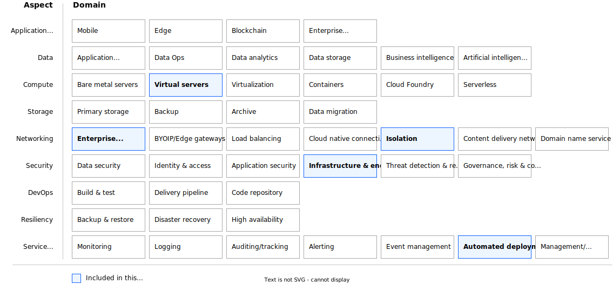

---
copyright:
  years: 2023
lastupdated: "2023-04-13"

keywords:

subcollection: deployable-reference-architectures

authors:
  - name: Arnold Beilmann

version: v7.0.0

deployment-url: https://cloud.ibm.com/catalog/architecture/deploy-arch-ibm-pvs-inf-2dd486c7-b317-4aaa-907b-42671485ad96-global

docs: https://cloud.ibm.com/docs/powervs-vpc

image_source: https://github.com/terraform-ibm-modules/terraform-ibm-powervs-infrastructure/reference-architectures/extension/deploy-arch-ibm-pvs-inf-extension.svg

related_links:
  - title: 'SAP in IBM Cloud documentation'
    url: 'https://cloud.ibm.com/docs/sap'
    description: 'SAP in IBM Cloud documentation.'
  - title: 'Reference architecture for "Secure infrastructure on VPC for regulated industries" as standard variation'
    url: 'https://cloud.ibm.com/docs/deployable-reference-architectures?topic=deployable-reference-architectures-vsi-ra'
    description: 'Reference architecture for "Secure infrastructure on VPC for regulated industries" as standard variation'

use-case: ITServiceManagement

industry: Technology

compliance: SAPCertified

content-type: reference-architecture

---

{{site.data.keyword.attribute-definition-list}}

# Power Virtual Server with VPC landing zone - as 'Extension' of VPC landing zone
{: #deploy-arch-ibm-pvs-inf-extension}
{: toc-content-type="reference-architecture"}
{: toc-industry="Technology"}
{: toc-use-case="ITServiceManagement"}
{: toc-compliance="SAPCertified"}
{: toc-version="7.0.0"}

The Power Virtual Server with VPC landing zone as variation 'Extend Power Virtual Server with VPC landing zone' creates an additional Power Virtual Server workspace and connects it with already created Power Virtual Server with VPC landing zone. It builds on existing Power Virtual Server with VPC landing zone deployed as a variation 'Create a new architecture'.

## Architecture diagram
{: #ext-architecture-diagram}

{: caption="Figure 1. Single-zone PowerVS workspace accessible over secure landing zone" caption-side="bottom"}{: external download="deploy-arch-ibm-pvs-inf-extension.svg"}

## Design requirements
{: #ext-design-requirements}

{: caption="Figure 2. Scope of the solution requirements" caption-side="bottom"}

IBM Cloud® Power Virtual Servers (PowerVS) is a public cloud offering that an enterprise can use to establish its own private IBM Power computing environment on shared public cloud infrastructure. PowerVS is logically isolated from all other public cloud tenants and infrastructure components, creating a private, secure place on the public cloud. This deployable architecture provides a framework to build a PowerVS offering according to the best practices and requirements from the IBM Cloud.

## Components
{: #ext-components}

### VPC architecture decisions
{: #ext-vpc-components-arch}

| Requirement | Component | Choice | Alternative choice |
|-------------|-----------|--------------------|--------------------|
|* Ensure public internet connectivity  \n * Isolate most virtual instances to not be reachable directly from the public internet|Edge VPC service|Connect to an existing dedicated VPC service where public internet connectivity is allowed to be configured| |
|* Provide infrastructure administration access  \n * Limit the number of infrastructure administration entry points to ensure security audit|Management VPC service|Connect to an existing dedicated VPC service where SSH connectivity from outside is allowed| |
|* Provide infrastructure for service management components like backup, monitoring, IT service management, shared storage  \n * Ensure you can reach all IBM Cloud and on-premises services|Workload VPC service|Connect to an existing dedicated VPC service configured as an isolated environment, without direct public internet connectivity and without direct SSH access| |
|* Allow customer to choose operating system from two most widely used commercial Linux operating system offerings  \n * Support new OS releases|Linux operating system|Red Hat Enterprise Linux (RHEL)|SUSE Linux Enterprise Server(SLES)| |
|* Ensure that there is a virtual server instance that can act as an internet proxy server|Proxy server VPC instance|Connect to an existing Linux VPC instance that can act as a proxy server with preconfigured ACL and security group rules to allow public internet traffic over proxy that uses default proxy ports (3828)|Configure or connect to a configured application load balancer to act as proxy server manually|
|* Ensure chosen virtual server instance as the only management access point to the landscape|Bastion host VPC instance|Connect to an existing Linux VPC instance that acts as a bastion host. ACL and security group rules of this instance allow SSH connectivity (port 22). Public IP address attached to this VPC instance. Connectivity is restricted from a limited number of public IP addresses. Connectivity from IP addresses of the Schematics engine nodes is allowed.||
|* Ensure that there is a virtual server instance to host basic management services like DNS, NTP, NFS|Management services VPC instance|Connect to an existing Linux VPC instance that can host management components. Configure ACL and security group rules to allow communication for basic management components.|Modify number of virtual server instances and allowed ports in preset or perform the modifications manually|
|* Ensure financial services compliancy for VPC services  \n * Perform network setup of all created services  \n * Perform network isolation of all created services  \n * Ensure all created services are interconnected |Secure landing zone components|Connect to a secure landing zone with a minimum set of required components|Connect to a secure landing zone with a modified set of required components|
{: caption="Table 1. VPC architecture decisions" caption-side="bottom"}

### PowerVS workspace architecture decisions
{: #ext-pvs-components-workspace}

| Requirement | Component | Choice | Alternative choice |
|-------------|-----------|--------------------|--------------------|
|* Connect PowerVS workspace with VPC services|Cloud connections|Set up two redundant cloud connections| |
|* Configure the network for management of all instances  \n * Throughput and latency are not relevant|Management network|Configure private network with default configurations and attach it to both cloud connections| |
|* Configure separate network for backup purposes with higher data throughput|Backup network|Configure separate private network with default configurations and attach it to both cloud connections. Networks characteristics might be adapted by the users manually (for example to improve throughput)| |
|* Preload OS images relevant for customer workload|Preloaded OS images|Preload Linux OS images for SAP workload. Keep the number of preloaded images at minimum to save costs.|Modify the input parameter that specifies the list of preloaded OS images.|
|* Preload a public SSH key that is injected into every OS deployment|Preloaded SSH public key|Preload customer specified SSH public key| |
{: caption="Table 2. PowerVS workspace architecture decisions" caption-side="bottom"}

### PowerVS management services architecture decisions
{: #ext-pvs-components-mgmt}

| Requirement | Component | Choice | Alternative choice |
|-------------|-----------|--------------------|--------------------|
|* Ensure public internet connectivity from all the instances to be deployed in PowerVS workspace|SQUID proxy|Use SQUID proxy software on Linux virtual server instance that is running in edge VPC|                    |
|* Provide shared NFS storage that might be directly attached to all the instances to be deployed in PowerVS workspace|NFS server|Use exported NFS disk that is attached to Linux virtual server instance that is running in workload VPC. Disk size is specified by the user.|Shared NFS storage on VPC is optional.|
|* Provide time synchronization to all instances to be deployed in PowerVS workspace|NTP forwarder|Synchronize time by using public NTP servers. Use time synchronization on Linux virtual server instance running in workload VPC.|By using time synchronization servers directly reachable from PowerVS workspace, NTP forwarder is not required.|
|* Provide a DNS forwarder to a DNS server not directly reachable from PowerVS workspace (for example, running on-premises or in other isolated environment)|DNS forwarder|Use DNS forwarder on Linux virtual server instance running in workload VPC| By using default IBM Cloud DNS service, DNS forwarder is not needed. Direct domain name resolution is possible.|
{: caption="Table 3. PowerVS management services architecture decisions" caption-side="bottom"}

### Network security architecture decisions
{: #ext-net-sec}

| Requirement | Component | Choice | Alternative choice |
|-------------|-----------|--------------------|--------------------|
|* Isolate edge VPC and allow only a limited number of network connections  \n * All other connections from or to edge VPC are forbidden|ACL and security group rules in edge VPC|Open following ports by default: 53 (DNS service), 8443 (OS registration), 443 (HTTPS), 80 (HTTP).  \n All ports to PowerVS workspace are open.  \n All ports to other VPCs are open.|More ports might be opened in preset or added manually after deployment|
|* Isolate management VPC and allow only a limited number of network connections  \n * All other connections from or to management VPC are forbidden|ACL and security group rules in management VPC|Open following ports by default: 22 (for limited number of IPs).  \n All ports to PowerVS workspace are open.  \n All ports to other VPCs are open.|More ports might be opened in preset or added manually after deployment|
|* Isolate workload VPC and allow only a limited number of network connections  \n * All other connections from or to workload VPC are forbidden|ACL and security group rules in workload VPC|Open following ports by default: 53 (DNS service).  \n All ports to PowerVS workspace are open.  \n All ports to other VPCs are open.|More ports might be opened in preset or added manually after deployment|
|* Enable floating IP on bastion host to execute deployment|Floating IPs on bastion host in management VPC|Use floating IP on bastion host from IBM Schematics to complete deployment|                    |
|* Preload VPN configuration to simplify VPN setup|VPNs|VPN configuration is the responsibility of the customer|                    |
{: caption="Table 4. Network security architecture decisions" caption-side="bottom"}

### Key and password management architecture decisions
{: #ext-key-pw}

| Requirement | Component | Choice | Alternative choice |
|-------------|-----------|--------------------|--------------------|
|* Use public/private SSH key to access virtual server instances by using SSH  \n * Use SSH proxy to log in to all virtual server instances by using the bastion host  \n * Do not store private ssh key on any virtual instances, also not on the bastion host  \n * Do not allow any other SSH login methods except the one with specified private/public SSH key pair|Public SSH key - provided by customer. Private SSH key - provided by customer.|Ask customer to specify the keys. Accept the input as secure parameter or as reference to the key stored in IBM Cloud Secure Storage Manager. Do not print SSH keys in any log files. Do not persist private SSH key. Ask for private SSH key only if management components can be reconfigured, otherwise do not enforce private SSH key to be entered.|                    |
{: caption="Table 5. Key and passwords management architecture decisions" caption-side="bottom"}

## Compliance
{: #ext-compliance}

This reference architecture is certified for SAP deployments.

## Next steps
{: #ext-next-steps}

Install the SAP on Power deployable architecture on this infrastructure.
