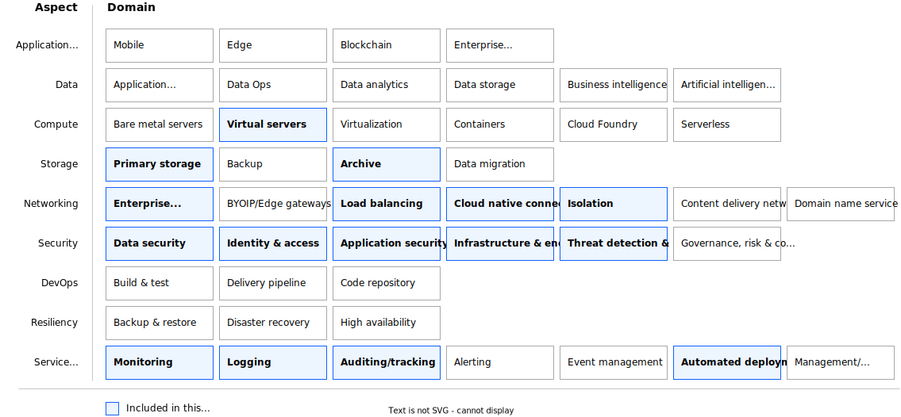

---
copyright:
  years: 2023
lastupdated: "2023-08-03"

keywords:

subcollection: deployable-reference-architectures

authors:
  - name: Arnold Beilmann

version: v1.0.0

# Whether the reference architecture is published to Cloud Docs production.
# When set to false, the file is available only in staging. Default is false.
production: true

deployment-url: https://cloud.ibm.com/catalog/architecture/deploy-arch-ibm-pvs-inf-2dd486c7-b317-4aaa-907b-42671485ad96-global

docs: https://cloud.ibm.com/docs/powervs-vpc

image_source: https://github.com/terraform-ibm-modules/terraform-ibm-powervs-infrastructure/blob/main/reference-architectures/quickstart/deploy-arch-ibm-pvs-inf-quickstart.svg

related_links:
  - title: 'Reference architecture for "Secure infrastructure on VPC for regulated industries" as standard variation'
    url: 'https://cloud.ibm.com/docs/deployable-reference-architectures?topic=deployable-reference-architectures-vsi-ra'
    description: 'Reference architecture for "Secure infrastructure on VPC for regulated industries" as standard variation'

use-case: ITServiceManagement

industry: Technology

compliance: TODO

content-type: reference-architecture

---

{{site.data.keyword.attribute-definition-list}}

# Power Virtual Server with VPC landing zone - as new deployment
{: #deploy-arch-ibm-pvs-inf-quickstart}
{: toc-content-type="reference-architecture"}
{: toc-industry="Technology"}
{: toc-use-case="ITServiceManagement"}
{: toc-compliance="TODO"}
{: toc-version="1.0.0"}

New deployment of the Power Virtual Server with VPC landing zone creates VPC services , a Power Virtual Server workspace and interconnects them. It also deploys a Power Virtual Server of chosen T-shirt size or custom configuration. Supported Os are Aix, IBM i and Linux images.

A proxy service for public internet access from the PowerVS workspace is configured. You can optionally configure some management components on VPC (such as an NFS server, NTP forwarder, and DNS forwarder).

## Architecture diagram
{: #full-architecture-diagram}

{: caption="Figure 1. Single-zone PowerVS workspace accessible over secure landing zone" caption-side="bottom"}{: external download="deploy-arch-ibm-pvs-inf-quickstart.svg"}

## Design requirements
{: #full-design-requirements}
TODO FILE HERE
{: caption="Figure 2. Scope of the solution requirements" caption-side="bottom"}

IBM Cloud® Power Virtual Servers (PowerVS) is a public cloud offering that an enterprise can use to establish its own private IBM Power computing environment on shared public cloud infrastructure. PowerVS is logically isolated from all other public cloud tenants and infrastructure components, creating a private, secure place on the public cloud. This deployable architecture provides a framework to build a PowerVS offering according to the best practices and requirements from the IBM Cloud.

## Components
{: #full-components}

### VPC architecture decisions
{: #full-vpc-components-arch}

| Requirement | Component | Choice | Alternative choice |
|-------------|-----------|--------------------|--------------------|
|* Ensure public internet connectivity  \n * Isolate most virtual instances to not be reachable directly from the public internet|Edge VPC service|Create a separate VPC service where public internet connectivity is allowed to be configured| |
|* Provide infrastructure administration access  \n * Limit the number of infrastructure administration entry points to ensure security audit|Management VPC service|Create a separate VPC service where SSH connectivity from outside is allowed| |
|* Provide infrastructure for service management components like backup, monitoring, IT service management, shared storage  \n * Ensure you can reach all IBM Cloud and on-premises services|Workload VPC service|Create a separate VPC service as an isolated environment, without direct public internet connectivity and without direct SSH access| |
|* Allow customer to choose operating system from two most widely used commercial Linux operating system offerings  \n * Support new OS releases|Linux operating system|Red Hat Enterprise Linux (RHEL)|SUSE Linux Enterprise Server(SLES)| |
|* Create a virtual server instance that can act as an internet proxy server and host basic management services like DNS, NTP, NFS|Proxy server, Bastion host and Management services VPC instance|Create a Linux VPC instance that can act as a proxy server, bastion host and can host management components. Preconfigure ACL and security group rules to allow public internet traffic over proxy that uses default proxy ports (3828). \nConfigure ACL and security group rules to allow SSH connectivity (port 22). Add a public IP address to the VPC instance. Allow connectivity from a restricted and limited number of public IP addresses. Allow connectivity from IP addresses of the Schematics engine nodes.   \nConfigure ACL and security group rules to allow communication for basic management components | Configure application load balancer to act as proxy server manually.  \nModify number of virtual server instances and allowed ports in preset or perform the modifications manually|
|* Ensure financial services compliancy for VPC services  \n * Perform network setup of all created services  \n * Perform network isolation of all created services  \n * Ensure all created services are interconnected |Secure landing zone components|Create a minimum set of required components for a secure landing zone|Create a modified set of required components for a secure landing zone in preset|
{: caption="Table 1. VPC architecture decisions" caption-side="bottom"}

### PowerVS workspace architecture decisions
{: #full-pvs-components-workspace}

| Requirement | Component | Choice | Alternative choice |
|-------------|-----------|--------------------|--------------------|
TODO

### PowerVS management services architecture decisions
{: #full-pvs-components-mgmt}

| Requirement | Component | Choice | Alternative choice |
|-------------|-----------|--------------------|--------------------|
TODO

### Network security architecture decisions
{: #full-net-sec}

| Requirement | Component | Choice | Alternative choice |
|-------------|-----------|--------------------|--------------------|
TODO
{: caption="Table 4. Network security architecture decisions" caption-side="bottom"}

### PowerVS instance - architecture decisions
{: #pvs-components}

| Requirement | Component | Choice | Alternative choice |
|-------------|-----------|--------------------|--------------------|
TODO
{: caption="Table 2. PowerVS workspace architecture decisions" caption-side="bottom"}

### Key and password management architecture decisions
{: #full-key-pw}

| Requirement | Component | Choice | Alternative choice |
|-------------|-----------|--------------------|--------------------|
|* Use public/private SSH key to access virtual server instances by using SSH  \n * Use SSH proxy to log in to all virtual server instances by using the bastion host  \n * Do not store private ssh key on any virtual instances, also not on the bastion host  \n * Do not allow any other SSH login methods except the one with specified private/public SSH key pair|Public SSH key - provided by customer. Private SSH key - provided by customer.|Ask customer to specify the keys. Accept the input as secure parameter or as reference to the key stored in IBM Cloud Secure Storage Manager. Do not print SSH keys in any log files. Do not persist private SSH key.|                    |
{: caption="Table 5. Key and passwords management architecture decisions" caption-side="bottom"}

## Compliance
{: #full-compliance}

TODO
