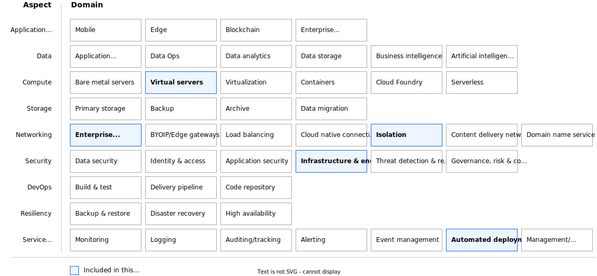

---
copyright:
  years: 2024, 2025
lastupdated: "2025-03-05"
keywords:
subcollection: deployable-reference-architectures
authors:
  - name: Arnold Beilmann
  - name: Suraj Bharadwaj
  - name: Ludwig Mueller
production: true
deployment-url: https://cloud.ibm.com/catalog/architecture/deploy-arch-ibm-pvs-inf-2dd486c7-b317-4aaa-907b-42671485ad96-global
docs: https://cloud.ibm.com/docs/powervs-vpc
image_source: https://github.com/terraform-ibm-modules/terraform-ibm-powervs-infrastructure/reference-architectures/standard-extend/deploy-arch-ibm-pvs-inf-standard-extend.svg
use-case: ITServiceManagement
industry: Technology
content-type: reference-architecture
version: v8.2.0
compliance: SAPCertified

---

{{site.data.keyword.attribute-definition-list}}

# Power Virtual Server with VPC landing zone - 'Standard Extend Variation'
{: #deploy-arch-ibm-pvs-inf-extension}
{: toc-content-type="reference-architecture"}
{: toc-industry="Technology"}
{: toc-use-case="ITServiceManagement"}
{: toc-compliance="SAPCertified"}
{: toc-version="v8.2.0"}

The Power Virtual Server with VPC landing zone as variation 'Extend Power Virtual Server with VPC landing zone' creates an additional Power Virtual Server workspace and connects it with the already created Power Virtual Server with VPC landing zone. It builds on the existing Power Virtual Server with VPC landing zone deployed as a variation 'Create a new architecture'.

## Architecture diagram
{: #standard-extend-architecture-diagram}

{: caption="Figure 1. Single-zone PowerVS workspace accessible over secure landing zone" caption-side="bottom"}{: external download="deploy-arch-ibm-pvs-inf-standard-extend.svg"}

## Design requirements
{: #standard-extend-design-requirements}

{: caption="Figure 2. Scope of the solution requirements" caption-side="bottom"}

IBM Cloud® Power Virtual Servers (PowerVS) is a public cloud offering that an enterprise can use to establish its own private IBM Power computing environment on shared public cloud infrastructure. PowerVS is logically isolated from all other public cloud tenants and infrastructure components, creating a private, secure place on the public cloud. This deployable architecture provides a framework to build a PowerVS offering according to the best practices and requirements from the IBM Cloud.

## Components
{: #standard-extend-components}

### PowerVS workspace architecture decisions
{: #standard-extend-pvs-components-workspace}

| Requirement | Component | Choice | Alternative choice |
|-------------|-----------|--------------------|--------------------|
|* Connect PowerVS workspace with VPC services|Transit gateway| Set up a local transit gateway| |
|* Configure the network for management of all instances  \n * Throughput and latency are not relevant|Management network|Configure private network with default configurations| |
|* Configure separate network for backup purposes with higher data throughput|Backup network|Configure separate private network with default configurations and attach it to both cloud connections. Networks characteristics might be adapted by the users manually (for example to improve throughput)| |
|* Preload OS images relevant for customer workload|Preloaded OS images|Preload Stock catalog OS images.|Modify the input parameter that specifies the list of preloaded OS images.|
|* Allow optional import of custom OS images from Cloud Object Storage|Custom OS images|Import up to three images from COS into the PowerVS workspace.|Modify the optional input parameters that specify the list of custom OS images and the COS configuration and credentials .|
|* Preload a public SSH key that is injected into every OS deployment|Preloaded SSH public key|Preload customer specified SSH public key| |
{: caption="Table 2. PowerVS workspace architecture decisions" caption-side="bottom"}

### PowerVS management services architecture decisions
{: #standard-extend-pvs-components-mgmt}

| Requirement | Component | Choice | Alternative choice |
|-------------|-----------|--------------------|--------------------|
|* Ensure public internet connectivity from all the instances to be deployed in PowerVS workspace|SQUID proxy|Set up SQUID proxy software on Linux virtual server instance that is running in edge VPC|                    |
|* Provide shared NFS storage that might be directly attached to all the instances to be deployed in PowerVS workspace| File storage shares in VPC|Use the files storage share service running in VPC. Disk size is specified by the user.| |
|* Provide time synchronization to all instances to be deployed in PowerVS workspace|NTP forwarder|Synchronize time by using public NTP servers. Set up time synchronization on Linux virtual server instance that is running in workload VPC.|By using time synchronization servers directly reachable from PowerVS workspace, NTP forwarder is not required.|
|* Provide a DNS forwarder to a DNS server not directly reachable from PowerVS workspace (for example, running on-premises or in other isolated environment)|DNS forwarder|Configure DNS forwarder on Linux virtual server instance that is running in edge VPC| By using default IBM Cloud DNS service, DNS forwarder is not needed. Direct domain name resolution is possible.|
{: caption="Table 3. PowerVS management services architecture decisions" caption-side="bottom"}

### Key and password management architecture decisions
{: #standard-extend-key-pw}

| Requirement | Component | Choice | Alternative choice |
|-------------|-----------|--------------------|--------------------|
|* Use public/private SSH key to access virtual server instances by using SSH  \n * Use SSH proxy to log in to all virtual server instances by using the bastion host  \n * Do not store private ssh key on any virtual instances, also not on the bastion host  \n * Do not allow any other SSH login methods except the one with specified private/public SSH key pair|Public SSH key - provided by customer. Private SSH key - provided by customer.|Ask customer to specify the keys. Accept the input as secure parameter or as reference to the key stored in IBM Cloud Secure Storage Manager. Do not print SSH keys in any log files. Do not persist private SSH key. Ask for private SSH key only if management components can be reconfigured, otherwise do not enforce private SSH key to be entered.|                    |
{: caption="Table 5. Key and passwords management architecture decisions" caption-side="bottom"}

## Compliance
{: #standard-extend-compliance}

This reference architecture is certified for SAP deployments.

## Next steps
{: #standard-extend-next-steps}

Install the SAP on Power deployable architecture on this infrastructure.
