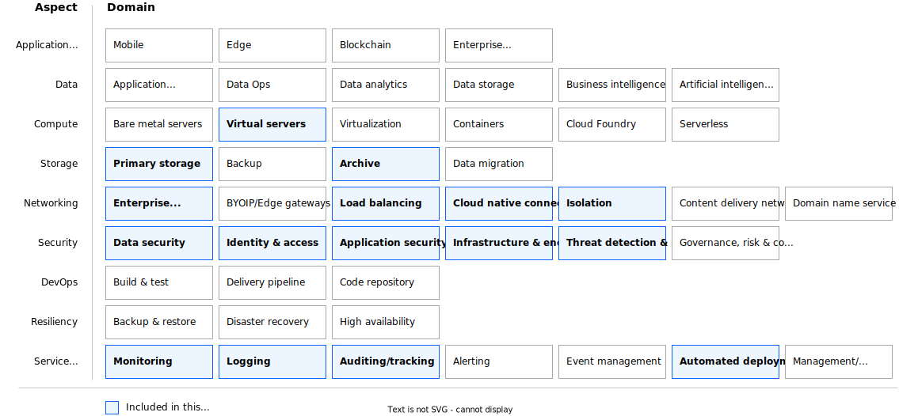

---
copyright:
  years: 2024
lastupdated: "2024-07-24"
keywords:
subcollection: deployable-reference-architectures
authors:
  - name: Arnold Beilmann
  - name: Suraj Bharadwaj
production: true
deployment-url: https://cloud.ibm.com/catalog/architecture/deploy-arch-ibm-pvs-inf-2dd486c7-b317-4aaa-907b-42671485ad96-global
docs: https://cloud.ibm.com/docs/powervs-vpc
image_source: https://github.com/terraform-ibm-modules/terraform-ibm-powervs-infrastructure/reference-architectures/standard/deploy-arch-ibm-pvs-inf-standard.svg
use-case: ITServiceManagement
industry: Technology
content-type: reference-architecture
version: v6.0.0
compliance: SAPCertified

---

{{site.data.keyword.attribute-definition-list}}

# Power Virtual Server with VPC landing zone - 'Standard Variation'
{: #deploy-arch-ibm-pvs-inf-standard}
{: toc-content-type="reference-architecture"}
{: toc-industry="Technology"}
{: toc-use-case="ITServiceManagement"}
{: toc-compliance="SAPCertified"}
{: toc-version="6.0.0"}

The Standard deployment of the Power Virtual Server with VPC landing zone creates VPC services and a Power Virtual Server workspace and interconnects them.

A proxy service for public internet access from the PowerVS workspace is configured. You can optionally configure some management components on VPC (such as an NFS service, NTP forwarder, and DNS forwarder).

## Architecture diagram
{: #standard-architecture-diagram}

{: caption="Figure 1. Single-zone PowerVS workspace accessible over secure landing zone" caption-side="bottom"}{: external download="deploy-arch-ibm-pvs-inf-standard.svg"}

## Design requirements
{: #standard-design-requirements}
{: caption="Figure 2. Scope of the solution requirements" caption-side="bottom"}

IBM Cloud® Power Virtual Servers (PowerVS) is a public cloud offering that an enterprise can use to establish its own private IBM Power computing environment on shared public cloud infrastructure. PowerVS is logically isolated from all other public cloud tenants and infrastructure components, creating a private, secure place on the public cloud. This deployable architecture provides a framework to build a PowerVS offering according to the best practices and requirements from the IBM Cloud.

## Components
{: #standard-components}

### VPC architecture decisions
{: #standard-vpc-components-arch}

| Requirement | Component | Choice | Alternative choice |
|-------------|-----------|--------------------|--------------------|
|* Ensure public internet connectivity  \n * Isolate most virtual instances to not be reachable directly from the public internet|Edge VPC service with network services security group.|Create a separate security group service where public internet connectivity is allowed to be configured| |
|* Provide infrastructure administration access  \n * Limit the number of infrastructure administration entry points to ensure security audit|Edge VPC service with management security group.|Create a separate security group where SSH connectivity from outside is allowed| |
|* Provide infrastructure for service management components like backup, monitoring, IT service management, shared storage  \n * Ensure you can reach all IBM Cloud and on-premises services|Client to site VPN, NFS as a service(NFSaaS) and security groups |Create a client to site VPN and VPE full strict security groups rules without direct public internet connectivity and without direct SSH access| |
|* Allow customer to choose operating system from two most widely used commercial Linux operating system offerings  \n * Support new OS releases|Linux operating system|Red Hat Enterprise Linux (RHEL)| |
|* Create a virtual server instance as the only management access point to the landscape|Bastion host VPC instance|Create a Linux VPC instance that acts as a bastion host. Configure ACL and security group rules to allow SSH connectivity (port 22). Add a public IP address to the VPC instance. Allow connectivity from a restricted and limited number of public IP addresses. Allow connectivity from IP addresses of the Schematics engine nodes| |
|* Create a virtual server instance that can act as an internet proxy server and to host basic management services like DNS, NTP, NFS|Network services VPC instance|Create a Linux VPC instance that can host management components. Preconfigure ACL and security group rules to allow traffic over private networks only.|Configure application load balancer to act as proxy server manually, Modify number of virtual server instances and allowed ports in preset or perform the modifications manually|
|* Ensure financial services compliancy for VPC services  \n * Perform network setup of all created services  \n * Perform network isolation of all created services  \n * Ensure all created services are interconnected |Secure landing zone components|Create a minimum set of required components for a secure landing zone|Create a modified set of required components for a secure landing zone in preset|
{: caption="Table 1. VPC architecture decisions" caption-side="bottom"}

### PowerVS workspace architecture decisions
{: #standard-pvs-components-workspace}

| Requirement | Component | Choice | Alternative choice |
|-------------|-----------|--------------------|--------------------|
|* Connect PowerVS workspace with VPC services|Transit gateway| Set up a local transit gateway| |
|* Configure the network for management of all instances  \n * Throughput and latency are not relevant|Management network|Configure private network with default configurations| |
|* Configure separate network for backup purposes with higher data throughput|Backup network|Configure separate private network with default configurations. Network characteristics might be adapted by the users manually (for example to improve throughput)| |
|* Preload OS images relevant for customer workload|Preloaded OS images|Preload Stock catalog OS images.|Modify the input parameter that specifies the list of preloaded OS images.|
|* Preload a public SSH key that is injected into every OS deployment|Preloaded SSH public key|Preload customer specified SSH public key| |
{: caption="Table 2. PowerVS workspace architecture decisions" caption-side="bottom"}

### PowerVS management services architecture decisions
{: #standard-pvs-components-mgmt}

| Requirement | Component | Choice | Alternative choice |
|-------------|-----------|--------------------|--------------------|
|* Ensure public internet connectivity from all the instances to be deployed in PowerVS workspace|SQUID proxy|Set up SQUID proxy software on Linux virtual server instance that is running in edge VPC|                    |
|* Provide shared NFS storage that might be directly attached to all the instances to be deployed in PowerVS workspace| File storage shares in VPC|Use the files storage share service running in VPC. Disk size is specified by the user.||
|* Provide time synchronization to all instances to be deployed in PowerVS workspace|NTP forwarder|Synchronize time by using public NTP servers. Set up time synchronization on Linux virtual server instance that is running in workload VPC.|By using time synchronization servers directly reachable from PowerVS workspace, NTP forwarder is not required.|
|* Provide a DNS forwarder to a DNS server not directly reachable from PowerVS workspace (for example, running on-premises or in other isolated environment)|DNS forwarder|Configure DNS forwarder on Linux virtual server instance that is running in edge VPC| By using default IBM Cloud DNS service, DNS forwarder is not needed. Direct domain name resolution is possible.|
{: caption="Table 3. PowerVS management services architecture decisions" caption-side="bottom"}

### Network security architecture decisions
{: #standard-net-sec}

| Requirement | Component | Choice | Alternative choice |
|-------------|-----------|--------------------|--------------------|
|* Preload VPN configuration to simplify VPN setup|VPNs|VPN configuration is the responsibility of the customer. Automation creates a client to site VPN server||
|* Enable floating IP on bastion host to execute deployment|Floating IPs on bastion host in management VPC|Use floating IP on bastion host from IBM Schematics to complete deployment||
|* Isolate management VSI and allow only a limited number of network connections  \n * All other connections from or to management VPC are forbidden|Security group rules for management VSI|Open following ports by default: 22 (for limited number of IPs).  \n All ports to PowerVS workspace are open.  \n All ports to other VPCs are open.|More ports might be opened in preset or added manually after deployment|
|* Isolate network services VSI, VPEs and NFaaS |Security group rules in edge VPC|Separate security groups are created for each component and only certain IPs or Ports are allowed. |More ports might be opened in preset or added manually after deployment|
{: caption="Table 4. Network security architecture decisions" caption-side="bottom"}

### Key and password management architecture decisions
{: #standard-key-pw}

| Requirement | Component | Choice | Alternative choice |
|-------------|-----------|--------------------|--------------------|
|* Use public/private SSH key to access virtual server instances by using SSH  \n * Use SSH proxy to log in to all virtual server instances by using the bastion host  \n * Do not store private ssh key on any virtual instances, also not on the bastion host  \n * Do not allow any other SSH login methods except the one with specified private/public SSH key pair|Public SSH key - provided by customer. Private SSH key - provided by customer.|Ask customer to specify the keys. Accept the input as secure parameter or as reference to the key stored in IBM Cloud Secure Storage Manager. Do not print SSH keys in any log files. Do not persist private SSH key.|                    |
|* Use public/private SSH key to access virtual server instances by using SSH  \n * Use SSH proxy to log in to all virtual server instances by using the private IPS of instances using a VPN client  \n * Do not store private ssh key on any virtual instances  \n * Do not allow any other SSH login methods except the one with specified private/public SSH key pair|Public SSH key - provided by customer. Private SSH key - provided by customer.|Ask customer to specify the keys. Accept the input as secure parameter or as reference to the key stored in IBM Cloud Secure Storage Manager. Do not print SSH keys in any log files. Do not persist private SSH key.|                    |
{: caption="Table 5. Key and passwords management architecture decisions" caption-side="bottom"}

## Compliance
{: #standard-compliance}

This reference architecture is certified for SAP deployments.

## Next steps
{: #standard-next-steps}

Install the SAP on Power deployable architecture on this infrastructure.
